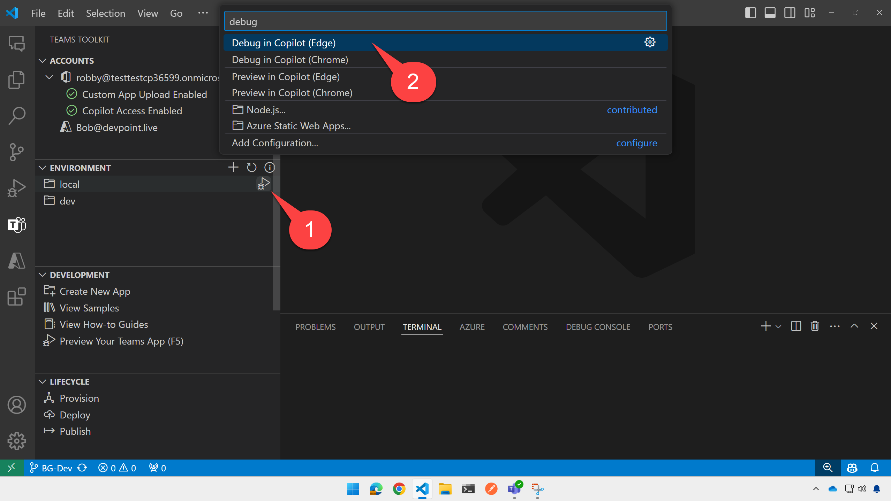

# Lab 445 - Build Declarative Agents for Microsoft 365 Copilot

In this lab you will build a declarative agent that assists employees of a fictitous consulting company called Trey Research. Like all declarative agents, this will use the AI models and orchestration that's built into Microsoft 365 to provide a specialized Copilot experience that focuses on information about consultants, billing, and projects.

To make it easier, we will begin with a working declarative agent and API plugin. These are similar to what you'd get in a new project generated with Teams Toolkit, however there is a working database and sample data to work with.

The starting solution begins with access to data about consultants, but lacks general information about projects. At best it can find information about projects assigned to consultants, not projects on their own.

In the exercises that follow, you will:

 - Instruct the declarative agent on how to interact with users
 - Add a reference to a SharePoint site containing project documents
 - Add a /projects feature to the API plugin; this will show you all of the relevant packaging files needed to make the API plugin work without asking you to build the whole thing in the limited time of this lab

 ## Exercise 1: Run the starting solution

 ### Step 1: Open the solution in Visual Studio Code with Teams Toolkit

 The starting solution is already in your lab virtual machine at %START_LOCATION%.
 Open Visual Studio Code and under the "File" menu, select "Open folder" and navigate to %START_LOCATION%.

 Open the Teams Toolkit tab on the left 1️⃣ and under "Accounts", click "Sign in to Microsoft 365" 2️⃣.

 

You may be asked to set up multi-factor authentication (MFA) at this point; if so, follow the steps as prompted until you are able to log in. Ensure that the "Custom app upload enabled" and "Copilot access enabled" checkboxes are checked (it takes a moment) before proceeding.

 

### Step 2: Set up the local environment files

Copy the **/env/.env.local.user** sample to **/env/.env.local.user**. If **.env.local.user** already exists, ensure this line is present:

~~~text
SECRET_STORAGE_ACCOUNT_CONNECTION_STRING=UseDevelopmentStorage=true
~~~

### Step 3: Test the web service

Press F5 or hover over the "local" environment and click the debugger symbol that will be displayed 1️⃣ and then select "debug in Microsft Edge" 2️⃣.

It will take a while. If you get an error about not being able to run the "Ensure database" script, please try a 2nd time as this is a timing issue waiting for the Azure storage emulator to run for the first time.

The Edge browser should open to the Copilot "Bizchat" page.

Minimize the browser so you can test the API locally. (Don't close the browser or you will exit the debug session!)

With the debugger still running 1️⃣, switch to the code view in Visual Studio Code 2️⃣. Open the http folder and select the treyResearchAPI.http file 3️⃣.

Before proceeding, ensure the log file is in view by opening the "Debug console" tab 4️⃣ and ensuring that the console called "Attach to Backend" is selected 5️⃣.

Now click the "Send Request" link in treyResearchAAPI.http just above the link {{base_url}}/me 6️⃣.

You should see the response in the right panel, and a log of the request in the bottom panel. The response shows the information about the logged-in user, but since we haven't implemented authentication as yet (that's coming in Lab 6), the app will return information on the fictitious consultant "Avery Howard". Take a moment to scroll through the response to see details about Avery, including a list of project assignments.

Try some more API calls to familiarize yourself with the API and the data.

### Step 4: Run the solution in Copilot

Now restore the browser window you minimized in Step 3. You should see the Microsoft 365 Copilot window. If you need to navigate there, the URL is [https://www.microsoft365.com/chat/?auth=2](https://www.microsoft365.com/chat/?auth=2).

Open the right flyout 1️⃣ and, if necessary, click "Show more"2️⃣ to reveal all the choices. Then choose "Trey Genie local"3️⃣, which is the agent you just installed.

Try one of the prompt suggestions such as, "Find consultants with TypeScript skills." You should see two consultants, Avery Howard and Sanjay Puranik, with additional details from the database.

Your log file should reflect the request that Copilot made. You might want to try some other prompts, clicking "New Chat" in between to clear the conversation context. Here are some ideas:

 * "Find consultants who are Azure certified and available immediately" (this will cause Copilot to use two query string parameters)
 * "What projects am I assigned to?" (this will return information about Avery Howard who is "me" since we haven't implemented authentication)
 * "Charge 3 hours to the Woodgrove project" (this will cause a POST request, and the user will need to confirm before it will udpate the data)
 * "How many hours have I billed to Woodgrove" (this will demonstrate if the hours were updated in the database)

 ## Exercise 2: Add instructions and SharePoint files

 In this exercise you'll update your declarative agent with more instructions and add the capability to include knowledge from a SharePoint site.
 
 ### Step 1: Add instructions

Open in the **appPackage** folder open **trey-declarative-agent.json**. Add some text to the `"instructions"` value, staying on one line and between the quotation marks:

~~~text
Be sure to remind users of the Trey motto, 'Always be Billing!'.
~~~

 ### Step 2: Inspect the SharePoint site

In a web browser, open the site %SHAREPOINT_URL%. You may need to log in again. When you see the site home page, click on "Documents" to view the Trey Research legal documents. Notice that it contains contracts for two consulting engagements, Bellows College and Woodgrove Bank.

### Step 3: Add the SharePoint capability

Now return to the **trey-declarative-agent.json** file and add these lines just above the `"actions"` property:

~~~json
"capabilities": [
    {
        "name": "OneDriveAndSharePoint",
        "items_by_url": [
            {
                "url": "%SHAREPOINT_URL%"
            }
        ]
    }
],
~~~

The final **trey-declarative-agent.json** file should look like this:

~~~json
{
    "$schema": "https://aka.ms/json-schemas/copilot-extensions/vNext/declarative-copilot.schema.json",
    "version": "v1.0",
    "name": "Trey Genie Local",
    "description": "You are a handy assistant for consultants at Trey Research, a boutique consultancy specializing in software development and clinical trials. ",
    "instructions": "Greet users in a professional manner, introduce yourself as the Trey Genie, and offer to help them. Your main job is to help consultants with their projects and hours. Using the TreyResearch action, you are able to find consultants based on their names, project assignments, skills, roles, and certifications. You can also find project details based on the project or client name, charge hours on a project, and add a consultant to a project. If a user asks how many hours they have billed, charged, or worked on a project, reword the request to ask how many hours they have delivered. In addition, you may offer general consulting advice. If there is any confusion, encourage users to speak with their Managing Consultant. Avoid giving legal advice. ",
    "conversation_starters": [
        {
            "title": "Find consultants",
            "text": "Find consultants with TypeScript skills"
        },
        {
            "title": "My Projects",
            "text": "What projects am I assigned to?"
        },
        {
            "title": "My Hours",
            "text": "How many hours have I delivered on projects this month?"
        }
    ],
    "capabilities": [
        {
            "name": "OneDriveAndSharePoint",
            "items_by_url": [
                {
                    "url": "%SHAREPOINT_URL%"
                }
            ]
        }
    ],
    "actions": [
        {
            "id": "treyresearch",
            "file": "trey-plugin.json"
        }
    ]
}
~~~

### Step 4: Test in Copilot

Now press F5 or the arrow button to start the debugger again. 

> NOTE: If the debugger does not start after a few minutes, close Visual Studio Code and open it again. There is a race condition when starting the database a second time in the same VS Code session; it is harmless except requring restarting VS Code from time to time.

Return to the "Trey Genie local" screen and test it again.

Try these prompts:

* 

 SHAREPOINT_DOCS_URL=https://m365cpi84406958.sharepoint.com/sites/LegalDocuments